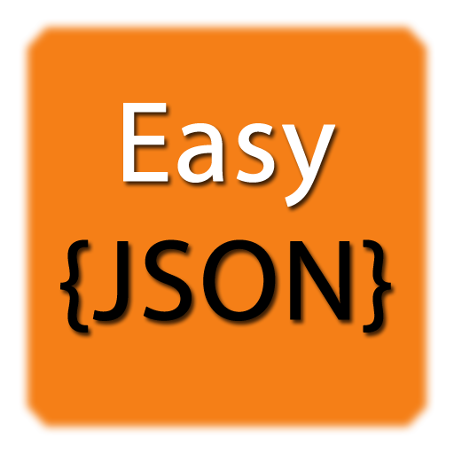

# EasyJSON

    

###### A simple JSON library for PHP.

EasyJSON is a simple JSON library for PHP. It allows easy conversion and serialization of PHP objects and arrays to JSON format.

EasyJSON requires <b>PHP version 7 or higher</b>.

##Guide
You can find a guide on how to use EasyJSON [here](https://panickapps.github.io/EasyJSON).

##Examples
You can also find a full example in the 'example' directory on this repository.

##Bug reporting
You can report bugs related to this library by email [here](mailto:panickapps@gmail.com?subject=EasyJSON).